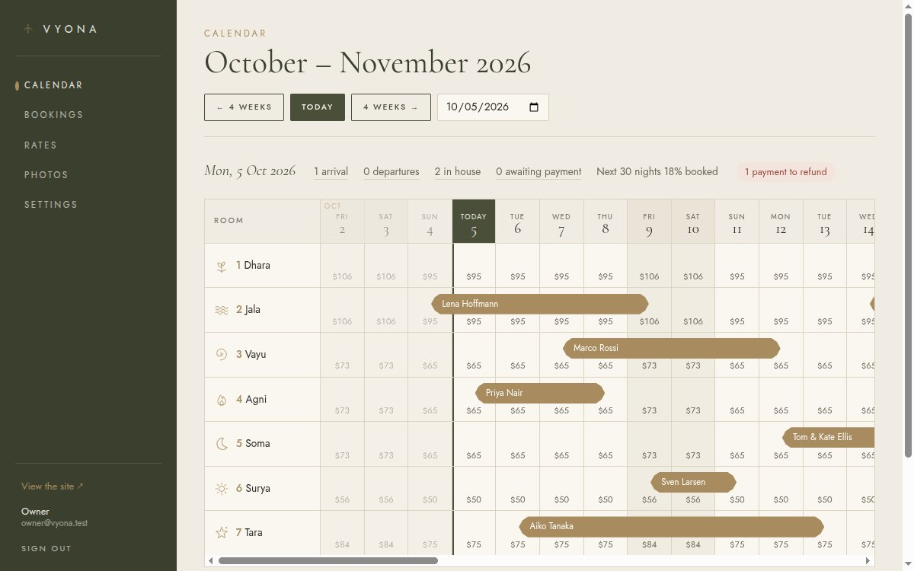
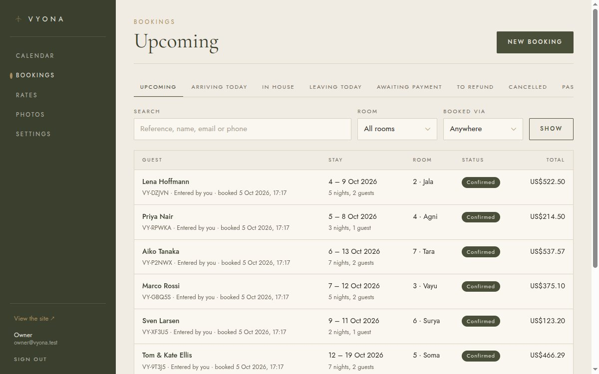

<div align="center">

# VYONA

**Direct-booking system for a seven-room boutique villa in Weligama, Sri Lanka.**

A Next.js public site with an interactive 3D villa and a live booking calendar, PayHere checkout
with room holds that can't double-book, an owner's admin, and a job worker for emails and
channel sync. Postgres, Prisma, Redis and BullMQ in a pnpm + Turborepo monorepo, developed in
Docker and run under PM2 in production.

</div>


## Status

| Phase | What | State |
|---|---|---|
| 0 | Single-file HTML prototype for the client to review ([`prototype/`](prototype/)) | Done, approved, live at [vyonaweligama.com](https://vyonaweligama.com) |
| 1.1–1.3 | Monorepo, pricing and availability core, public site ported from the prototype | Done |
| 1.4 | Booking flow: room holds, PayHere checkout, confirmation emails, hold expiry | Done |
| 1.5 | Owner's admin: calendar, bookings, rates, photos, settings | Done |
| 1.6 | Booking.com sync through Beds24 | Done (against a stand-in until the Beds24 account exists) |
| 1.7 | Production release, deployment and backups | Ready; first deploy waits on server setup |

The full specification is in [docs/booking-engine-spec.md](docs/booking-engine-spec.md), and the
3D and motion rules are in [docs/frontend-visual-guide.md](docs/frontend-visual-guide.md).

## The public site

|  |  |
|---|---|
| **Interactive 3D villa** | A stylised model of the grounds built in code with Three.js: buildings, hipped roofs, palms with swaying fronds, loungers, a shade sail and a pergola. Orbit within limits, hover to make a zone glow, click to fly the camera there and open its card. Loaded with a dynamic import, only when it scrolls into view. |
| **Custom water shader** | The pool is a `ShaderMaterial`: layered sine waves displace the surface, normals are rebuilt from finite differences, and the fragment shader adds depth tint, animated caustics, a fresnel sky reflection and a sun glint. |
| **Liquid image hover** | One shared WebGL canvas moves over whichever image the pointer is on and redraws it through a ripple shader, so there are no per-image contexts. |
| **Live booking calendar** | Two months of real availability and nightly prices from the server, a hover range preview, guest stepper, USD/LKR toggle, a server-side hold with a countdown, then PayHere. A bottom sheet on mobile. |
| **Motion** | Ken Burns hero cross-fade, GSAP ScrollTrigger parallax at several depths, `scaleY` image unveils, magnetic buttons on a spring, and a custom cursor. Transform and opacity only, and reduced motion is respected. |
| **Graceful degradation** | A capability check (WebGL, renderer string, `deviceMemory`, `hardwareConcurrency`, `saveData`, reduced motion, viewport) swaps the 3D scene for a photo slider and switches off the ripple and cursor on weak devices. `?lite=1` and `?full=1` force either mode. |
| **Fast photos without an optimiser** | Photos are converted once to 1200px WebP plus a 24px blurred placeholder stored in the database. The placeholder paints immediately inside a fixed aspect box, so nothing shifts, and the files are served with a one-year cache. |

Pages are server components. Room pages carry JSON-LD `HotelRoom` data, and the layout carries
`LodgingBusiness`.

<table>
<tr>
<td width="50%"></td>
<td width="50%"></td>
</tr>
<tr>
<td></td>
<td align="center"></td>
</tr>
</table>

## Booking

1. **Quote.** `packages/core` prices each night from the room's base rate, season and weekday
   rules, and any price the owner set for that night. A service charge and a long-stay discount
   are applied on top. Money is integer cents in USD.
2. **Hold.** "Review booking" locks the room's nights with `SELECT … FOR UPDATE` inside one
   transaction and holds them for 15 minutes. A concurrency test fires 20 parallel holds at the
   same nights and expects exactly one to win.
3. **Pay.** Each attempt opens a PayHere payment with a server-signed form. Only PayHere's
   signed notify confirms a booking. Retried notifies are idempotent, a late failure can't undo
   a payment, and a payment that lands after its hold expired either takes the nights back or
   alerts the owner to refund.
4. **After.** The worker emails the guest and the owner, and sweeps expired holds every minute.

Without PayHere credentials in development, checkout goes to a built-in test gateway at
`/book/pay/mock` that checks the same hash and signs a notify the same way.

## Booking.com

Booking.com is connected through [Beds24](https://beds24.com), a channel manager, over its API v2.
The worker runs every exchange, one at a time, and writes each one to a sync log the owner can
read under **Booking.com** in the admin.

- **Out.** Each linked room's nightly price, minimum stay and closed nights go to Beds24 within a
  minute of a change, and the full year is sent again every night. Website and manual bookings
  become Beds24 bookings, so Beds24 closes those nights on Booking.com itself. A raw availability
  count is never sent, so it can't overwrite a Booking.com sale that hasn't reached us yet.
- **In.** A Beds24 webhook names a booking, and the worker fetches it from the API and applies it
  by its Beds24 id, so a replay changes nothing. A check every 10 minutes catches anything the
  webhook missed, and pushes any of our bookings Beds24 doesn't have.
- **Clashes.** A Booking.com booking takes nights from a guest who is still paying (who then
  gets the refund path if they pay late), but never from a confirmed booking. It is recorded
  anyway, the owner gets an "Overbooked" email, and it takes the nights once the other booking
  moves or is cancelled.

Until the villa has a Beds24 account, development runs against a built-in stand-in, and the admin
can play a Booking.com guest: book a linked room, overbook it, or cancel. In production with no
Beds24 key, sync is simply off.

## The admin

The owner's desk runs on its own subdomain.

- **Calendar:** rooms against six weeks of nights, with bookings by source, holds, closed nights,
  custom prices and minimum stays. Drag across nights (or tap two on a phone) to close or open
  them, or set a price or minimum stay.
- **Bookings:** views for arrivals, departures, guests in house, payments due and refunds, plus
  search. A booking can be moved to new dates or another room, cancelled with an optional email
  to the guest, or entered by hand for walk-ins and phone bookings.
- **Booking.com:** link rooms to Beds24, send prices or check for bookings on demand, and read
  the sync log.
- **Rates, photos and settings:** base rates and season or weekday rules; photo upload,
  ordering, covers and alt text; service charge, discounts, the LKR rate, payment time and
  pay-at-villa.

Sign-in uses scrypt password hashes and sessions whose tokens are stored only as SHA-256, with a
lockout after repeated failures.

<table>
<tr>
<td width="50%"></td>
<td width="50%"></td>
</tr>
</table>

## Quick start

Everything runs in Docker; `node_modules` and `.next` live in named volumes, not on the host.

```bash
git clone https://github.com/<your-user>/vyona-villa.git
cd vyona-villa
cp .env.example .env      # set ADMIN_EMAIL and ADMIN_PASSWORD (10+ characters) for the first login
docker compose up
```

The app container installs dependencies, applies migrations, seeds the rooms and rate rules,
imports photos and starts every app:

| Service | URL |
|---|---|
| Public site | http://localhost:3000 |
| Admin | http://localhost:3001 |
| Mailpit (catches every email) | http://localhost:8025 |

The client's photographs are not in this repository. The site runs without them, with empty
photo slots. To use your own, put them in `images/` and map them in
[`packages/db/src/media-data.ts`](packages/db/src/media-data.ts), or upload them in the admin.

```bash
docker compose run --rm sh pnpm typecheck    # also: test, build, db:migrate, db:studio
docker compose run --rm sh pnpm media:import  # images/ → WebP + placeholders
```

Core tests run against a separate `vyona_test` database that the test setup creates and
truncates, so development data is never touched. CI runs typecheck, tests and a full build
against Postgres and Redis services.

## Production

The server runs the three apps under [PM2](https://pm2.keymetrics.io/), with Postgres and Redis
installed alongside. CI checks every push. On `main` it also builds the release: the two Next
apps as standalone servers, and the worker as a single bundle. The server never builds anything.
[`scripts/deploy-app.sh`](scripts/deploy-app.sh) downloads the release, uploads only what
changed, runs the migrations and restarts the apps. A nightly cron job backs up the database and
photos.

```bash
scripts/deploy-app.sh               # newest green build: upload, migrate, restart, wait for health
scripts/deploy-app.sh --tag <sha>   # one exact build; also how to roll back
scripts/deploy-app.sh --backups     # copy the nightly backups off the server
```

The server setup, cut-over and restore steps are in [deploy/README.md](deploy/README.md).

## Project layout

```
apps/
  web/        Next.js public site; the public API lives in its route handlers
  admin/      Next.js owner's desk
  worker/     BullMQ worker: hold expiry, emails, Booking.com sync
packages/
  core/       pricing, availability, holds, payments, PayHere signing, admin operations, auth
  db/         Prisma schema, migrations, seed (the client's room brief), photo conversion
  ui/         design tokens (Tailwind 4 @theme), line icons, logo
prototype/    Phase 0: the single-file HTML prototype
docker/       the development image
deploy/       PM2 config, backup script, server runbook
brand/        logo and mark, redrawn as SVG
docs/         specifications and screenshots
```

## Design

The palette and typography come from the villa's own design reference: linen `#F1ECE3`, sand
`#E6DED1`, olive `#4A4F3A`, ink `#2B2A26`, taupe `#6B6457` and a bronze accent `#A88B5E`, set in
Cormorant Garamond with Jost for labels. The seven rooms are named for elements, each with its
own line icon: Dhara (earth), Jala (water), Vayu (air), Agni (fire), Soma (moon), Surya (sun)
and Tara (star).

Pages are mobile-first and checked from 320px to 2560px with no horizontal scroll.

## The prototype

Before the real system, the owner needed to review the design from a phone with patchy
connectivity. So [`prototype/`](prototype/) builds into a single HTML file: every photo is a
WebP data URI, every font is inlined, and Three.js, GSAP and Motion are bundled in. It runs
offline from an email attachment, booking flow (mocked) and 3D scene included. A second build
writes the photos as files for the live site instead, cutting the page from 2.8 MB to 356 KB
compressed.

```bash
docker compose run --rm prototype npm run build      # → .dist/vyona-prototype.html
docker compose run --rm prototype npm run build:web  # → .dist/web/
docker compose up prototype                          # watch + serve on :5173
```

The prototype is frozen as the visual reference; every effect in it has been ported to
`apps/web`.

## Licence

Code is [MIT](LICENSE). The VYONA name, logo, photographs and written copy are the property of
VYONA, Weligama, and are not licensed for reuse. Replace them with your own if you build on this.
