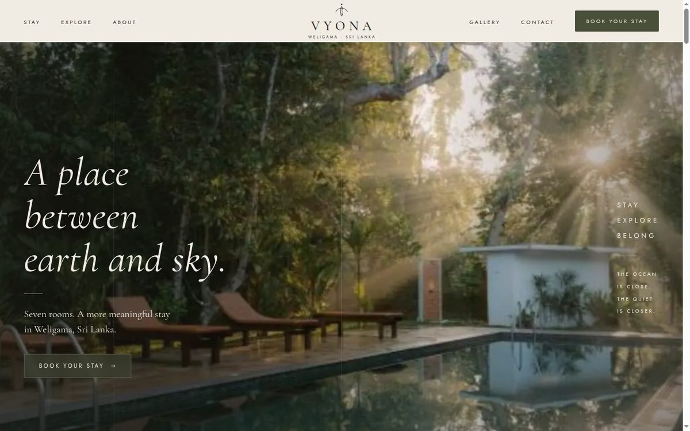
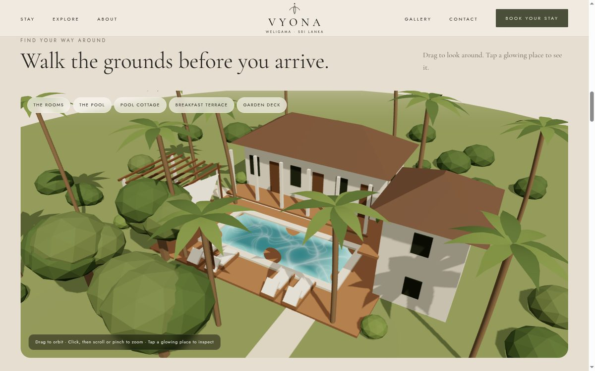
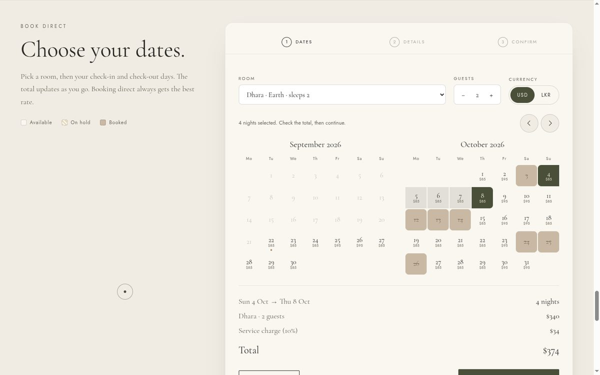
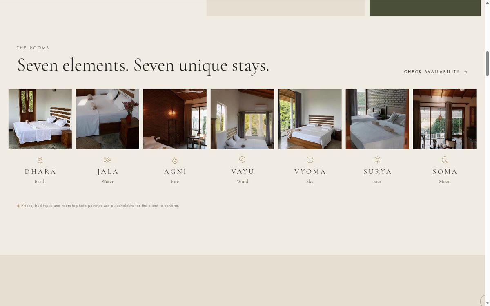
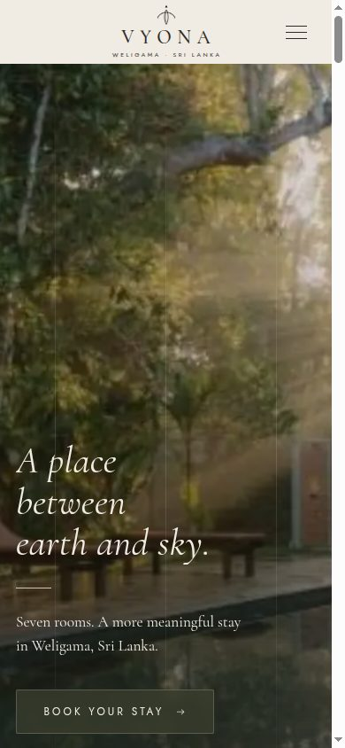

<div align="center">

# VYONA

**Direct-booking site for a seven-room boutique villa in Weligama, Sri Lanka.**

A single-file, fully offline HTML prototype with an interactive 3D villa, a custom GLSL water
shader, a shader-based liquid hover and a working mock booking flow — built with Three.js, GSAP
and Motion, bundled by esbuild into one 4 MB file you can send over WhatsApp.

</div>



## Why a single file

The villa's owner needed to review the design before the real system was built, from a phone, with
patchy connectivity. So the prototype is one HTML file: every photo is a WebP data URI, every font
is inlined base64, and Three.js, GSAP and Motion are bundled in. Open it from an email attachment
on a plane and the 3D scene still runs. The only network request on the page is the Google Maps
iframe, and it loads lazily and only when the browser reports it is online.

## What's in it

|  |  |
|---|---|
| **Interactive 3D villa** | A stylised model of the grounds built entirely in code — buildings, hipped roofs, palms with swaying fronds, loungers, a shade sail and a pergola. Orbit with damping and auto-rotate, hover to make a zone glow, click to fly the camera there and open its card. |
| **Custom water shader** | The pool is a `ShaderMaterial`: layered sine waves displace the surface, normals are rebuilt from finite differences, and the fragment shader adds depth tint, animated caustics, a fresnel sky reflection and a sun glint. |
| **Liquid image hover** | One shared WebGL canvas is moved over whichever image the pointer is on and redraws it through a ripple-distortion shader — no per-image contexts. |
| **Mock booking flow** | Two-month calendar with availability, per-night pricing, hover range preview, guest stepper, USD/LKR toggle, validation, a 15-minute hold with a live countdown, and a confirmation reference. A bottom sheet on mobile. |
| **Motion** | Ken Burns hero cross-fade, GSAP ScrollTrigger parallax at several depths, `scaleY` image unveils, magnetic buttons on a spring, and a custom cursor that grows over links. Transform and opacity only. |
| **Graceful degradation** | A capability check (WebGL, renderer string, `deviceMemory`, `hardwareConcurrency`, `saveData`, reduced motion, viewport) swaps the 3D scene for a swipeable photo sequence and switches off the ripple and cursor on weak devices. |

<table>
<tr>
<td width="50%"></td>
<td width="50%"></td>
</tr>
<tr>
<td></td>
<td align="center"></td>
</tr>
</table>

## Quick start

The client's photographs are not in this repository, so the build needs your own images. Drop them
in `images/` and map them to the keys in `prototype/src/data/photos.json`.

```bash
git clone https://github.com/<your-user>/vyona-villa.git
cd vyona-villa

# one-off build → .dist/vyona-prototype.html
docker compose run --rm prototype npm run build

# or watch and serve on http://localhost:5173
docker compose up prototype
```

Node 22 and `npm install && npm run build` inside `prototype/` work too, if you'd rather not use
Docker. Add `?lite=1` to the URL to force the low-power fallback, or `?full=1` to force the full
experience.

## How the build works

`prototype/build.mjs` does three things:

1. **Photos** — sharp resizes each image to 1200px WebP (quality 60) and renders a 24px blurred
   placeholder. Both go into a JSON map, cached by file mtime, that the page reads from a
   `<script type="application/json">` tag. The placeholder shows immediately; the full image
   decodes off-screen and fades in, so layout never shifts.
2. **Code** — esbuild bundles the ES modules with `.woff2` as `dataurl`, `.glsl` and `.svg` as
   `text`, and minifies.
3. **Inlining** — the CSS, the JS bundle and the photo map are written into `index.html` at marker
   comments, producing `.dist/vyona-prototype.html`.

## Project layout

```
brand/                 logo and mark, redrawn as SVG
docs/                  specifications and screenshots
prototype/
  build.mjs            sharp + esbuild → one HTML file
  src/index.html       markup, with data-* hooks for every module
  src/styles/          design tokens, sections, responsive rules
  src/js/
    villa3d.js         the 3D scene, zones, camera flights, fallback slider
    water.vert.glsl    pool surface displacement
    water.frag.glsl    caustics, fresnel, sun glint
    booking.js         calendar, pricing, three-step flow, mobile drawer
    ripple.js          shared-canvas liquid hover
    motion.js          ScrollTrigger parallax and reveals
    capability.js      device tiering
    …                  hero, rooms, gallery, cursor, magnetic, images, ui, store
  src/data/photos.json photo key → filename
```

## Design

The palette and typography come from the villa's own design reference: linen `#F1ECE3`, sand
`#E6DED1`, olive `#4A4F3A`, ink `#2B2A26`, taupe `#6B6457` and a bronze accent `#A88B5E`, set in
Cormorant Garamond with Jost for labels. The seven rooms are named for elements — Dhara, Jala,
Agni, Vayu, Vyoma, Surya, Soma — each with its own line icon.

The page is mobile-first and verified from 320px to 2560px with no horizontal scroll. Reduced
motion is respected everywhere; the 3D scene renders only while it is on screen.

## Roadmap

Phase 0, the prototype in this repository, is complete and with the client. The production system
is specified in [docs/booking-engine-spec.md](docs/booking-engine-spec.md):

- **Phase 1** — Next.js monorepo (public site, admin, API), Postgres with Prisma, Redis and BullMQ
  for jobs, all in docker-compose.
- **Phase 2** — Booking.com ARI sync and webhooks, so rates and availability stay in step with the
  channel manager.
- **Phase 3** — Payments, email confirmations, and a real villa model. A `.glb` exported from the
  architectural model, compressed with Draco (`gltf-transform draco`) and loaded through
  `DRACOLoader`, will replace the coded scene; the zone, hover and camera logic stays as it is.

## Licence

Code is [MIT](LICENSE). The VYONA name, logo, photographs and written copy are the property of
VYONA, Weligama, and are not licensed for reuse — replace them with your own if you build on this.
